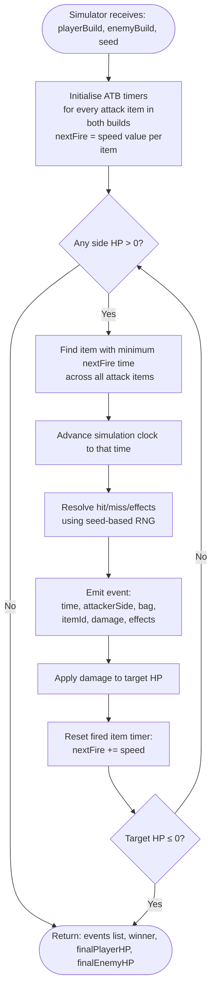
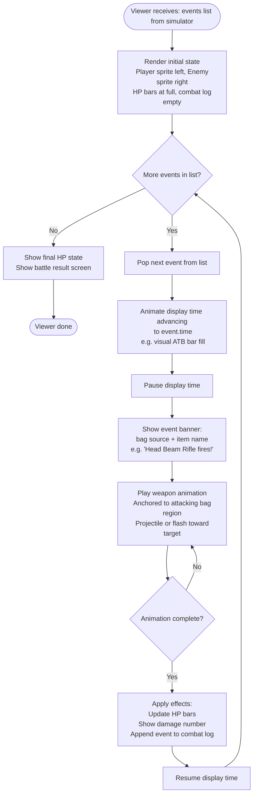

# ATB Battle Flow — Mech Bags Version 0.1

The ATB (Active Time Battle) system has two separate phases: **simulation** (deterministic event computation) and **playback** (animation driven by the event list). These must remain architecturally separable (ARC-001).

---

## Phase 1 — ATB Simulation (no rendering)

**Determinism guarantee:**
- Same `playerBuild + enemyBuild + seed` → identical events list every run.
- No `Date.now()`, no `Math.random()` inside the simulator.
- Seed-based PRNG used for all stochastic effects (hit/miss, crit, etc.).

---

## Phase 2 — ATB Battle Viewer (animation playback)

**BEH-004 enforcement:**
- Only one `PLAY_ANIM` block runs at a time.
- Display time is paused during `PLAY_ANIM`.
- The next event is not dequeued until the current animation is fully resolved.

---

## Animation anchors by bag

Each attack animation originates from the attacking bag's region on the mech sprite:

| Bag | Animation origin |
|---|---|
| Head | Top / head/camera area |
| Torso | Centre / chest area |
| Back | Over-shoulder / backpack area |
| Left Arm | Left side of mech |
| Right Arm | Right side of mech |

Items can be in any bag. The animation origin follows the **bag**, not the item's real-world anatomy. A beam rifle placed in the Head bag fires from the head area. This is intentional and should be visually readable (ARC-005).

---

## Notes

- **Skip/speed controls** (if scoped in Slice 06): fast-forward collapses the `ADVANCE_DISPLAY` time. Skip-to-result uses the simulator's already-computed result without playing the viewer at all.
- The viewer must never call back into the simulator during playback. It reads from the frozen event list only.
