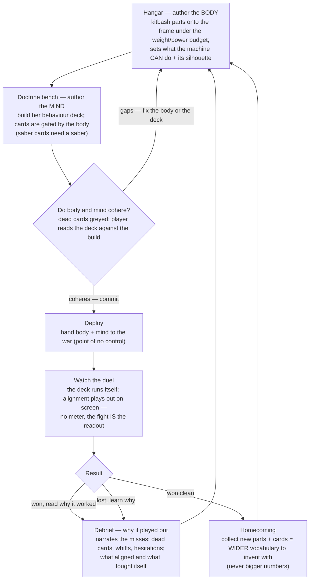

# Flow — Dual-layer core loop (r3)

The engineer authors a **body** and a **mind**, deploys, watches whether the two align, learns
from the debrief, and iterates. Granularity is "what surface am I on and what did I just author
or see" — not micro-interactions inside a screen. Supersedes the r2 core-loop
(`docs/wishlist/flows/core-loop.mmd`) and the Mech Bags run loop
(`Research/flows/run-loop-flow.md`).

The most likely failure/recovery path is the **Debrief → Hangar** edge: a loss (or an ugly win)
sends the player back to re-author the body or the deck, having been told exactly which cards
were dead, whiffed, or never fired. The loop is legible by construction — the fight and the
debrief are the only feedback, and both point at alignment.
