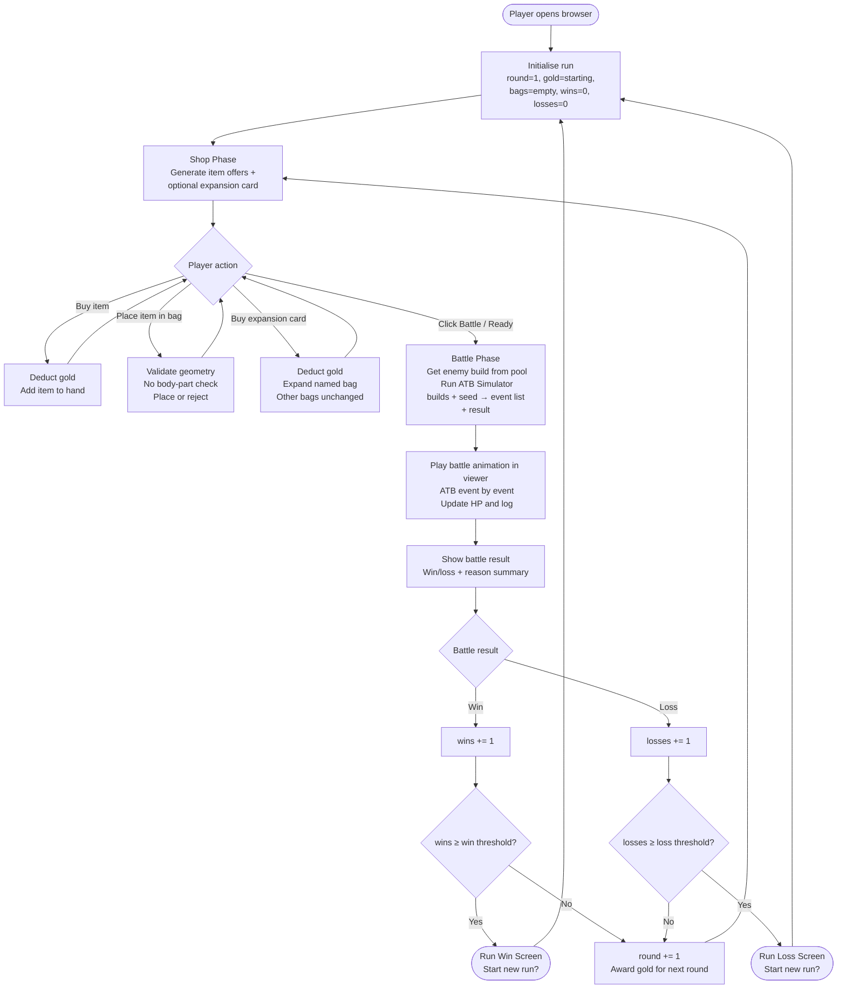

# Core Run Loop Flow — Mech Bags Version 0.1

The run loop is the outer gameplay structure. It cycles the player through shop/build phases and battle phases until a win or loss condition is reached.

---

## Mermaid diagram

---

## Notes

- **Win/loss thresholds** for Version 0.1 prototype: suggested 5 wins or 3 losses, but exact values TBD during Slice 07.
- **Enemy pool** selection: `pool[round % pool.length]` or similar; no network call.
- **Build persistence across rounds**: player's placed items carry over between rounds unless explicitly sold or swapped.
- **Gold between rounds**: a fixed gold award is given at round start; exact amount TBD in Slice 03.
- The shop phase may include a reroll action (costs gold); lock mechanic is optional/deferred.
