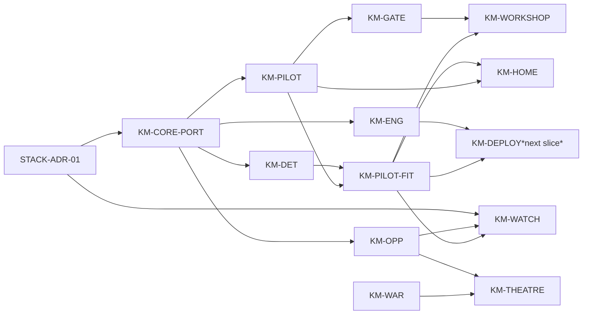

# Pilot, Pilot-Fit, and War-Front — High-Level Specification and Spec Work Map

## Rescope note (2026-06-14) — read first

The version line was rebooted. The authoritative design for the next version (v0.1) is now
docs/superpowers/specs/2026-06-14-backpack-engineering-system-design.md, which reshapes the
engineering layer of this contract. This document below remains the record for the pilot-fit
and war-front direction, which is deferred to v0.2+. What changed:

- The build model flips from the kitbash part-tree to a single unified spatial grid (a
  backpack). This supersedes the part-tree assumption in BEH-D03; the deterministic core
  (BEH-D01) and the sim-versus-render separation still hold — only the build surface changes.
- KM-ENG is no longer "a lean Layer-1 budget." It becomes the central system — grid + power
  battery economy + adjacency-transforming supports + bag expansions + recipes — and is
  decomposed in the Kanban as KM-BACKPACK-GRID, KM-SYNERGY, and KM-GRID-MECH (high risk).
- Layer 2 (pilot-fit / sync — KM-PILOT-FIT) is deferred to v0.2+. For v0.1 the pilot is only a
  source of unique items; the in-fight sync meter re-enters later as item behaviour.
- The next version is the backpack engineering gauntlet, not KM-DEPLOY. KM-DEPLOY, the
  persistent KM-PILOT, KM-WORKSHOP, KM-HOME, and KM-THEATRE move to v0.2+.
- KM-WATCH and STACK-ADR-01 are effectively satisfied: the Godot director spike confirmed the
  stack and produced the proven combat viewer (the locked guide is fight_log_everything +
  --director=hybrid). KM-CORE-PORT (build-driven deterministic sim) remains the open
  prerequisite for the gauntlet.

The wishlist (r2) vision is unchanged; only the build order moved.

---

Status: Draft refreshed 2026-06-06 (r3); rescoped header 2026-06-14 (see above). The vision is
locked (see wishlist r2); release framing is Steam PC first, mobile-app compatible second, web
optional; the stack is confirmed in practice (Godot 4.6 + GDScript, via the director spike).
The next version is the v0.1 backpack engineering gauntlet (see the rescope note); the
pilot-fit material below is the v0.2+ record. No child spec enters implementation planning
until the per-slice gates in §11 pass.
Created: 2026-06-06
Working title: Kitbash Mecha (no licensed Gundam IP in any product/code/doc copy)
Upstream intent: docs/wishlist/wishlist.md (r2) and docs/wishlist/flows/
Stack decision: docs/adrs/2026-06-06-build-stack-decision.md (STACK-ADR-01)

## Part I — High-Level Specification

## 1. Request

The owner asked to add the pilot layer and the war-front macro layer to the Kitbash Mecha
duel prototype, then refined the direction through design discussion into: a positive power
fantasy of building a persistent pilot and her mech into a feared ace; a three-layer
constraint model (machine engineering, pilot-machine fit, pilot behavior) with the
pilot-fit layer as the star; and a defining endgame in which the player's ace fights other
real players' stored builds in a living, contested war. Full intent is in the wishlist.

## 2. Request class

Mixed: new system, integration, and a platform port. The pilot, pilot-fit, and war layers
are new systems; they integrate into the existing deterministic duel core; and the project
moves from the plain-web JavaScript prototype to a Steam-first/mobile-compatible Godot 4.6 /
GDScript build, so the existing prototype becomes a reference to port rather than the shipping
codebase. Web export is optional for demos/playtests, not the product target.

## 3. Current pain

- The prototype proves the kitbash duel but has no stakes: nothing persists across battles
  and nothing the player is attached to is at risk, so no single fight matters.
- There is no pilot, so the fit engine that is meant to be the differentiator does not
  exist, and "power as potential the pilot grows into" has nothing to attach to.
- There is no macro layer, so a run is a flat sequence of fights with no living war to
  fight inside and no opponents beyond a static list.
- The current renderer is plain DOM tokens, which cannot deliver the animated rigged-2D
  combat the experience needs, and the JS core is not where the chosen stack will live.

## 4. Desired UX / system outcome

Desired UX is captured authoritatively in docs/wishlist/wishlist.md (r2) and the flows
under docs/wishlist/flows/ (core-loop.mmd, homecoming.mmd). The decomposition below maps
wishlist sections to candidate downstream artifacts in §13; it does not restate the
wishlist. For orientation: the player fits out a single bonded pilot's mech, weighs a
deploy gamble (detune for a safe run vs push the fit to chase a breakthrough), deploys into
a living war, watches the duel as sync climbs, and welcomes home a pilot who has grown —
all building toward an ace proven against other real players.

## 5. Non-negotiable existing behaviors

- BEH-004 — One primary attack animation at a time; sim time does not advance during it.
- BEH-D01 — The simulation is deterministic: the same build(s) + seed produce the identical
  event sequence. (Carries from the JS core to the GDScript port.)
- BEH-D02 — Mounted identity is a canonical nodeId path; cross-combat references are
  {side, nodeId}; owned inventory identity is ownedInstanceId. New layers do not overload
  these.
- BEH-D03 — The kitbash build, attach/detach, shop, and salvage behavior proven in the
  prototype is preserved in behavior when ported; the new layers wrap the build/sim/rig
  rather than replacing the model.

## 6. Allowed changes

- CHG-001 — The renderer and runtime move to Godot 4.6 / GDScript for a Steam-first,
  mobile-compatible product; the JS prototype is ported, not extended in place. The
  single-duel UI is reframed into the loop screens. Web export is optional.
- CHG-002 — resolve may take pilot and fit input; simulate may admit pilot abilities and
  fit/sync effects as deterministic events, provided BEH-D01 and BEH-004 hold.
- CHG-003 — The enemy provision becomes an injected opponent-build source: seeded ghost
  builds near-term, real-player stored builds later, behind one interface.
- CHG-004 — Run/progression state grows to persist a pilot (XP, sync ceiling, skills,
  growth, fit history) across battles.
- CHG-005 — The emotional valence is positive: no permanent harm to the pilot; the in-fight
  meter is sync climbing toward a breakthrough, not stress toward a breakdown.

## 7. Architecture constraints

- ARC-D01 — The simulation is a pure, deterministic, renderer-agnostic core (GDScript), with
  no rendering or DOM dependency.
- ARC-D02 — Active pilot abilities and fit/sync effects enter combat only as deterministic
  events through the existing ATB pipeline; no out-of-band effects during playback.
- ARC-D03 — Opponent builds are an injected data source behind one interface; the client
  simulates any build identically whether it came from a static file, a designer, or a real
  player. Provenance never leaks into the sim or the renderer.
- ARC-D04 — Determinism is the PvP enabler: a result must be reproducible from {builds, seed}
  so a headless re-simulation can verify it. The sim avoids float nondeterminism (integer/
  fixed-point logic, seeded PCG RNG).
- ARC-D05 — Product target is Steam PC first and mobile-app compatible second. Build target
  is Godot 4.6 + GDScript; web export is optional for demos/playtests, not a primary release
  platform. C++ via GDExtension is the only sanctioned perf escape hatch.
- ARC-D06 — Part, skill, gate, fit, ghost-build, and war-front definitions are data, not code.
- ARC-D07 — No backend in the near-term prototype; opponents are local seeded ghosts. The
  architecture must not preclude the backend the war endgame needs. No 3D. No Gundam IP.

## 8. Shared vocabulary

| Term | Definition |
|---|---|
| Pilot | A persistent in-run character with identity, XP/level, equipped skills, a sync ceiling, and growth history. Folds passive modifiers into the build and acts as a deterministic event source in combat. No permadeath. |
| Pilot-machine fit | How well a pilot can control a given machine: her capacity vs the machine's demand. A soft relationship, never a hard gate. |
| Sync (resonance) | The in-fight meter that climbs as pilot and machine perform well together, toward a breakthrough where the machine exceeds its baseline. |
| Breakthrough | A positive permanent gain from surviving a stretch fit: a learned trait, a sync milestone, or a newly unlocked ability. |
| Machine engineering (Layer 1) | The substrate budget: power, heat, armor vs firepower, weight. Kept lean. |
| Pilot behavior (Layer 3) | The pilot's combat decision logic; smart defaults near-term, opt-in rule list later, gated hard. |
| Skill↔part gate | The mutual requirement: a skill may need an installed part, a part may need an unlocked pilot ability, before either functions. |
| Opponent-build source | The injected interface that supplies an enemy build to simulate: seeded ghost near-term, real-player stored build later. |
| Ghost build | A saved/seeded build replayed deterministically, shaped like a real-player build, standing in for an opponent with no networking. |
| War-state | The local, provisional macro condition of the war that drifts from results and biases deploy options; a backdrop near-term, the PvP-aggregate endgame later. |
| Deploy gamble | The pre-deploy choice: detune for a safe, steady run vs push the fit to chase a breakthrough at the cost of a harder fight. |
| Sortie | One deploy → duel → return cycle. |

## 9. Global invariants

- INV-D01 — Exactly one authoritative pilot record per pilot per run; all surfaces read/write
  that one record.
- INV-D02 — Determinism holds across both new combat paths (passive fit folded pre-duel and
  active abilities/sync fired in-duel); both reproduce identically from inputs + seed.
- INV-D03 — Sync, XP, breakthroughs, and growth change only through defined outcome/homecoming
  transitions, never silently during build or playback.
- INV-D04 — A skill whose required part is missing, or a part whose pilot ability is not
  unlocked, is inert and visibly marked inert; it never half-functions.
- INV-D05 — The macro war-state never blocks the core loop; with war-state stubbed or empty
  the player can still build, deploy, watch, and return.
- INV-D06 — No game state inflicts permanent harm on the pilot; the worst outcome is slower
  growth or a lost fight (positive-valence invariant).
- INV-D07 — Underperformance is legible: any below-ceiling result is traceable on screen to
  fit/sync, never presented as unexplained luck.

## 10. System surfaces

| Surface ID | Surface | Current owner / area | Wishlist source | Notes |
|---|---|---|---|---|
| SURF-D01 | Workshop screen (kitbash + skills + fit/sync forecast) | v0.4 Workshop prototype (port/extend) | wishlist "three-layer model" / core-loop.mmd | Build screen + ability-chip gating already prototyped. |
| SURF-D02 | Deploy-decision panel (fit readout + gamble) | new | wishlist "growth" / core-loop.mmd | The next test slice. |
| SURF-D03 | Theatre screen (read war, pick front, deploy) | new | wishlist "the war is the point" | Provisional near-term. |
| SURF-D04 | Duel-watch screen (duel + sync viz + war context) | prototype rig (port) | wishlist "sending them out, and watching" | Legibility-critical. |
| SURF-D05 | Homecoming/debrief screen (growth + salvage) | prototype salvage (port/extend) | wishlist "homecoming" / homecoming.mmd | Positive valence. |
| SURF-D06 | Pilot record + growth state | new | wishlist "the pilot you build for" | Foundation data surface. |
| SURF-D07 | Pilot-fit + sync model | new | wishlist "three-layer model" (Layer 2) | The differentiator. |
| SURF-D08 | Machine engineering budget | prototype weight/balance seed | wishlist Layer 1 | Kept lean. |
| SURF-D09 | Combat sim core (GDScript port) | prototype game-core.js (port) | wishlist "sending them out" | Protected; admits pilot/fit events. |
| SURF-D10 | Opponent-build source interface | prototype enemy data (replace) | wishlist "the war is the point" | Injected; ghost now, network later. |
| SURF-D11 | Rig renderer (Godot cutout) | prototype DOM rig (replace) | ADR / wishlist tech | Cutout Sprite2D + manifest anchors. |

## 11. Acceptance gates

- GATE-001 — No child spec enters implementation planning until consolidation review approves
  its keep/merge/split/defer/delete status.
- GATE-002 — No implementation agent touches a Must-not-touch surface (notably the sim core
  SURF-D09 internals beyond agreed extension points) without filing a boundary escalation and
  halting.
- GATE-003 — Any combat-touching child ships a determinism test proving BEH-D01/INV-D02
  (identical event stream from fixed inputs + seed), and where relevant a headless re-sim
  parity check (ARC-D04).
- GATE-004 — STACK-ADR-01 confirmation spike passes before KM-WATCH and the rig half of
  KM-WORKSHOP enter implementation planning.
- GATE-005 — Implementation plan approval gate per slice (may-touch / must-not-touch /
  verification command declared).
- GATE-006 — Slice implementation review gate per slice.
- GATE-007 — Assembly gate: the loop runs in the Godot build (and a web export) without a
  backend.
- GATE-008 — Final acceptance: owner confirms the slice delivers the intended feeling
  (the legible deploy gamble and the ascent), not just the mechanics.

## 12. Open questions

- [RESOLVED 2026-06-06] OQ-001 — First test slice scope. Resolved by the v0.4 mechanics
  handoff: the next test version is the deploy decision (push for the breakthrough vs protect
  with a safe fit), realized as KM-DEPLOY on the Workshop, with a minimally legible watched
  fight and a growth readout. Evidence: Kitbash - Mechanics Handoff.md §4.
- [RESOLVED 2026-06-06] OQ-002 — Extend the prototype vs start fresh. Resolved: port the
  existing prototype systems into the Godot 4.6 build; reuse the model and behavior, not the
  DOM renderer. Evidence: STACK-ADR-01.
- [RESOLVED 2026-06-06] STACK-ADR-01 — Build stack. Resolved provisionally: Godot 4.6 +
  GDScript, pending the confirmation spike in the ADR §6. Evidence:
  docs/adrs/2026-06-06-build-stack-decision.md.
- [RESOLVED 2026-06-06] OQ-006 — Release framing. Resolved: Steam PC is the primary release
  target, mobile app compatibility is secondary, and web export is optional for demos/playtests
  only. This strengthens the Godot choice and removes web as a release gate.
- OQ-003 (non-blocking) — Minimal near-term war-state model (drift inputs; what it biases).
  Owner accepts it is a provisional grinder. Resolve thin inside KM-WAR.
- OQ-004 (non-blocking) — How active pilot abilities and sync effects slot into ATB
  tie-breaks deterministically. Resolve inside KM-PILOT-FIT / KM-DET.
- OQ-005 (non-blocking) — Generic renames for the IP-flagged mechanic (remote drones +
  attunement). Owner to name; placeholder acceptable.

Evidence inputs for resolved decisions: Kitbash - Mechanics Handoff.md (owner-provided);
docs/adrs/2026-06-06-build-stack-decision.md; the local Godot 4.6 docs corpus.

## Part II — Spec Work Map

## 13. Candidate downstream artifacts

| Spec ID | Title | Purpose | Type | Owns surfaces | Depends on | Risk | Initial decision |
|---|---|---|---|---|---|---|---|
| STACK-ADR-01 | Build stack | Confirm Godot 4.6 + GDScript for Steam PC primary / mobile-compatible release via the §6 spike. | decision spike | — | none | high | keep (next build) |
| KM-CORE-PORT | Sim core port | Port game-core.js to a pure deterministic GDScript core (tree, resolve, simulate, seeded PCG). | foundation contract | SURF-D09 | STACK-ADR-01 | high | keep |
| KM-PILOT | Pilot record + growth | Pilot identity, XP/level, skills, sync ceiling, growth history; outcome transitions. | foundation contract | SURF-D06 | KM-CORE-PORT | high | keep |
| KM-PILOT-FIT | Pilot-machine fit + sync | Layer 2: capacity vs demand, the fit readout, in-fight sync climbing to breakthrough; deterministic. The differentiator. | foundation contract | SURF-D07 | KM-PILOT, KM-DET | high | keep |
| KM-ENG | Machine engineering budget | Layer 1: power/heat/armor/weight, kept lean; feeds fit demand. | foundation contract | SURF-D08 | KM-CORE-PORT | med | keep |
| KM-GATE | Skill↔part gating | Mutual gating + inert-state semantics (already prototyped as ability chips). | foundation contract | SURF-D07 | KM-PILOT | low | keep |
| KM-DET | Determinism + verify | Reaffirm BEH-D01/INV-D02 for new paths; the determinism + headless re-sim test contract. | cross-cutting contract | SURF-D09 | KM-CORE-PORT | high | parent-owned |
| KM-OPP | Opponent-build source | The injected interface; seeded ghost builds near-term, network-shaped for later. | foundation contract | SURF-D10 | KM-CORE-PORT | med | keep |
| KM-WAR | Local war-state | Thin provisional war-state: drift + what it biases. | foundation contract | SURF-D03 (data) | none | med | keep |
| KM-DEPLOY | Deploy-decision test slice | The next test version: a tiny editable-parts workshop (2–3 choices), fit readout, the detune-vs-push gamble with projected sync/growth, a legible watched fight, and a growth readout. | vertical feature spec | SURF-D01, SURF-D02 | KM-PILOT-FIT, KM-ENG, KM-CORE-PORT | high | keep (next playable slice) |
| KM-WORKSHOP | Workshop fit-out journey | Kitbash + equip skills with gate feedback + fit/sync forecast; port/extend v0.4. | vertical feature spec | SURF-D01 | KM-PILOT-FIT, KM-GATE | med | keep |
| KM-WATCH | Duel-watch journey | Wrap the duel with sync viz, pilot presence, war context; legibility-critical. | vertical feature spec | SURF-D04, SURF-D11 | KM-PILOT-FIT, KM-OPP, STACK-ADR-01 | high | keep |
| KM-HOME | Homecoming/growth journey | Outcomes: XP/sync/skills, breakthroughs, salvage→fit; positive valence. | vertical feature spec | SURF-D05 | KM-PILOT, KM-PILOT-FIT | med | keep |
| KM-THEATRE | Deploy + theatre journey | Read war-state, pick a front, deploy. | vertical feature spec | SURF-D03 | KM-WAR, KM-OPP | med | keep |
| KM-DEF-BEHAVIOR | Pilot behavior rules (Layer 3) | Opt-in ordered if/then rules; then maybe a graph. | deferred | — | — | — | defer |
| KM-DEF-NET | Networked opponent source | Real-player stored builds + matchmaking + headless verify-server backend. | deferred | — | — | — | defer |
| KM-DEF-FACTION | Two-faction GM-steered live war | The north-star war with developer events. | deferred | — | — | — | defer |
| KM-DEF-PILOTS | Multiple-pilot stable | More than one bonded pilot. | deferred | — | — | — | defer |
| KM-DEF-SOL | Slice-of-life relationship | Between-mission bonding beyond outcomes. | deferred | — | — | — | defer |
| KM-DEF-GRUNT | Grunts in the field | Mass combatants alongside aces. | deferred | — | — | — | defer |
| KM-DEF-RESEARCH | Research from salvage | Salvage as research material. | deferred | — | — | — | defer |

## 14. Dependency graph

| Spec | Must follow | Reason |
|---|---|---|
| KM-CORE-PORT | STACK-ADR-01 | The port targets the confirmed engine/language. |
| KM-PILOT | KM-CORE-PORT | Pilot record lives in the ported core. |
| KM-PILOT-FIT | KM-PILOT, KM-DET | Fit/sync consume the pilot record and the determinism contract. |
| KM-ENG | KM-CORE-PORT | Engineering budget lives in the core; feeds fit demand. |
| KM-GATE | KM-PILOT | Gating consumes pilot skills/abilities. |
| KM-OPP | KM-CORE-PORT | Opponent source feeds builds to the core. |
| KM-DEPLOY | KM-PILOT-FIT, KM-ENG | The gamble is the fit/sync forecast over a small editable part set and engineering budget. |
| KM-WORKSHOP | KM-PILOT-FIT, KM-GATE | Fit-out renders fit/sync + gate feedback. |
| KM-WATCH | KM-PILOT-FIT, KM-OPP, STACK-ADR-01 | Needs sync events, an opponent, and the confirmed renderer. |
| KM-HOME | KM-PILOT, KM-PILOT-FIT | Growth writes the pilot record. |
| KM-THEATRE | KM-WAR, KM-OPP | Front choice reads war-state and biases the opponent source. |

(Mermaid not render-verified here; structure mirrors the table.)

## 15. Concurrency graph

| Spec | May run with | Must not run with | Reason |
|---|---|---|---|
| KM-CORE-PORT | none | all | Foundation everything depends on; settle first. |
| KM-PILOT | KM-ENG, KM-OPP, KM-WAR | KM-PILOT-FIT, KM-GATE, KM-DET | Those consume pilot vocabulary still being fixed. |
| KM-ENG | KM-PILOT, KM-OPP, KM-WAR | none | Standalone budget contract. |
| KM-WAR | KM-PILOT, KM-ENG, KM-OPP | KM-THEATRE | Theatre consumes the war-state. |
| KM-DEPLOY | KM-HOME | KM-WATCH, KM-WORKSHOP | Shared fit/sim/render assumptions; settle fit first. |
| KM-WATCH | KM-THEATRE | KM-DEPLOY, KM-WORKSHOP, KM-HOME | All touch combat/render surfaces. |

Recommended wave 0: STACK-ADR-01 confirmation spike (next build; Steam PC + mobile compatibility, optional web).
Recommended wave 1: KM-CORE-PORT only.
Recommended wave 2: KM-PILOT, KM-ENG, KM-OPP, KM-WAR (parallel where §15 allows).
Recommended wave 3: KM-DET, KM-GATE, then KM-PILOT-FIT.
Recommended wave 4 (the test version): KM-DEPLOY first, then KM-WATCH/KM-WORKSHOP/KM-HOME/
KM-THEATRE sequenced per §15.

## 16. Shared contracts

| Contract ID | Name | Applies to | Rule |
|---|---|---|---|
| CON-D01 | Determinism + verify contract | KM-CORE-PORT, KM-PILOT-FIT, KM-WATCH, KM-HOME, KM-OPP | Identical event streams from fixed inputs + seed; ship a byte-equal test and, where relevant, a headless re-sim parity check. |
| CON-D02 | Identity contract | all | nodeId / {side,nodeId} for mounted, ownedInstanceId for owned, one pilot record per pilot; no overloading. |
| CON-D03 | Opponent-source contract | KM-OPP, KM-WATCH, KM-THEATRE | Opponent builds arrive through one interface; provenance (static/designer/real-player) is invisible to sim and renderer. |
| CON-D04 | Positive-valence contract | KM-PILOT-FIT, KM-HOME, KM-DEPLOY | No mechanic inflicts permanent pilot harm; the in-fight meter is sync toward breakthrough; downside is slower growth or a lost fight. |
| CON-D05 | Legibility contract | KM-PILOT-FIT, KM-DEPLOY, KM-WATCH | Below-ceiling results must be traceable on screen to fit/sync, never presented as luck. |
| CON-D06 | Data-driven contract | all | Parts, skills, gates, fits, ghost builds, fronts are data. |

## 17. Parent change proposal rules

Every child spec starts with `## 0. Parent change proposals`. If none, it says `None.` If a
child discovers a missing or conflicting parent requirement, it adds [PCP-NN] entries with
proposed change, reason, affected specs, and whether it blocks implementation. Non-empty
proposals gate orchestrator review; workers propose, they do not apply parent changes.

## 18. Boundary escalation rules

Every implementation plan and prompt declares May touch / Must not touch / Escalate if
touching. If an agent must touch a Must-not-touch surface (notably the ported sim core
internals beyond agreed CHG-002 extension points), it halts and writes a Boundary Escalation
document (slice, forbidden surface, why it appears required, alternatives considered,
recommended decision) and does not continue until the orchestrator accepts a decision.

## 19. Recommended downstream artifact order

1. STACK-ADR-01 — run the confirmation spike (Godot 4.6 + GDScript cutout rig, runtime
   part-swap, FX, seeded sim, headless diff, Windows/Steam-PC smoke, mobile compatibility
   smoke, optional web export). Unblocks the renderer-facing specs.
2. KM-CORE-PORT — port the deterministic core to GDScript. (foundation)
3. KM-PILOT, KM-ENG, KM-OPP, KM-WAR — foundations that depend only on the core. (foundation)
4. KM-DET — determinism + verify contract. (cross-cutting)
5. KM-GATE — gating contract. (foundation)
6. KM-PILOT-FIT — the fit/sync star. (foundation)
7. KM-DEPLOY — the next test version. (vertical feature spec → vouse-writing-specs)
8. KM-WORKSHOP, KM-WATCH, KM-HOME, KM-THEATRE — sequenced per §15. (vertical feature specs)

Dispatch rule: decision spike → vouse-decision-spike-adr; foundation/cross-cutting →
concise contract; vertical feature spec → vouse-writing-specs; deferred → do not dispatch.

Note on the test version: the owner has asked to plan the next test version before building.
That planning is, in order: confirm the slice (KM-DEPLOY, done in §12), draft the contracts
KM-DEPLOY depends on to the depth the slice needs (KM-PILOT-FIT, KM-ENG, KM-CORE-PORT extension
points), write the KM-DEPLOY feature spec, then an implementation plan. The STACK confirmation
spike can run in parallel since KM-DEPLOY's logic is stack-independent until the watched fight
needs the renderer.

## 20. Decomposition self-check

- [x] §1 preserves the request and records the refined direction.
- [x] §4 cites the wishlist (r2) rather than re-deriving intent.
- [x] §3 states concrete pains.
- [x] §5 non-regression behaviors have IDs.
- [x] §6 allowed changes have IDs (incl. the Godot port and positive valence).
- [x] §7 architecture constraints have IDs (incl. the three new ones).
- [x] §8 parent vocabulary defined (incl. fit/sync/breakthrough/opponent-source).
- [x] §9 invariants have IDs (incl. positive-valence and legibility).
- [x] §10 surfaces have IDs traced to wishlist sources.
- [x] §11 gates cover stack-spike, child, consolidation, planning, review, assembly, final.
- [x] §12 records resolved decisions with dates and evidence, and remaining non-blockers.
- [x] §12 lists evidence paths.
- [x] §13 artifacts have honest types; Layer 3 behavior and networking are deferred.
- [x] §13 vertical feature specs own journeys, not code layers.
- [ ] §13 vertical specs Haiku-buildable — not yet; they gate on KM-PILOT-FIT/KM-CORE-PORT and
  the stack spike, which is intended.
- [x] §13 the decision spike is not routed to vouse-writing-specs.
- [x] §13 artifacts have initial decisions.
- [x] §14 dependency graph present with reasons.
- [x] §15 concurrency graph present and distinct.
- [x] §16 shared contracts explicit.
- [x] §17 parent change proposal format included.
- [x] §18 boundary escalation format included.
- [x] §19 recommended order + dispatch rule present.
- [x] No downstream artifact approved for implementation directly; consolidation still required.
